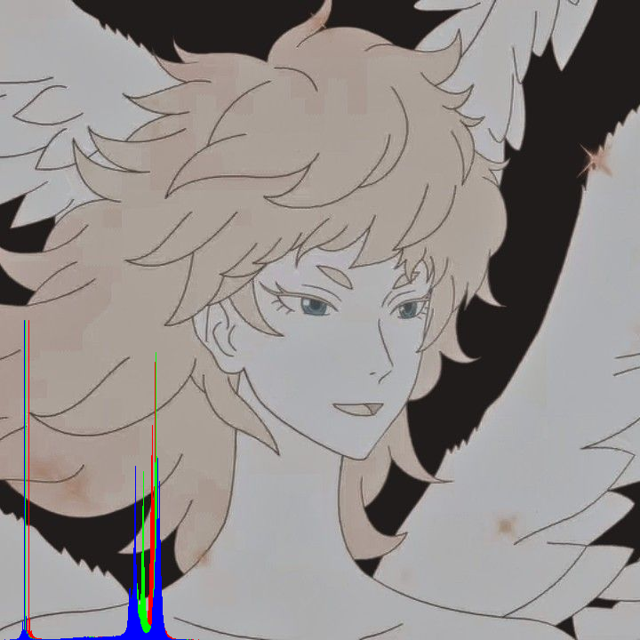

# Week-02 Task
Revert the provided code so that it shows the image in its original color, and then show 
three histograms: one each for the red, green, and blue channels of the image

### Requirements
Written in Processing 4.3\
No special libraries required.

### Operation
Run histogram_weekly_task.pde in Processing.

### Screengrab

### Design Notes

I struggled to understand how the array was being used to generate the histogram, but after talking with my peers in the lecture, it made sense to me. I had to think of each index of the array as a "well" or "bucket". Each time a pixel had a specific Red value, the index that represents that Red value would increase by 1. That is how the number pixels with a specific Red value is stored. Using that, you can create a histogram, where each value of each index determines the length of the line in the histogram.

The original histogram example provided used the Red channel of each pixel to generate a greyscale image. It did this by converting the green and blue channels into the same value as the red channel for each pixel.

I removed that aspect of the code, and then create three arrays of length 256 (as the range of 0-255 is 256 values) to represent each colour channel. The code then loops through each pixel in the image, and assigns each Red, Green, and Blue value to their respective index in their respective array. I also draw the image onto the canvas without altering any of its pixels.

I then call my drawHistogram() function for each array, which accepts an int[] array and a Color object. It will draw lines of a specific length of a specific colour based on the value stored at each index. 

