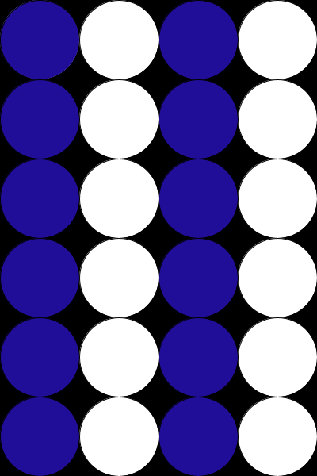
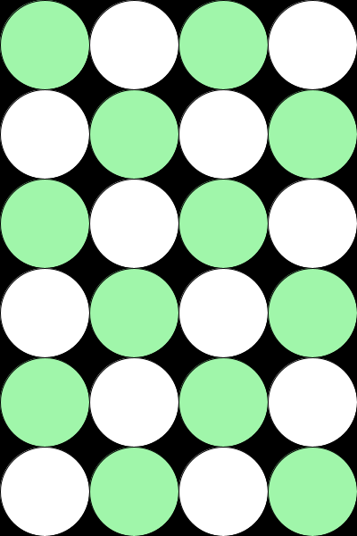

# Week-03 Task
Use the random() function in Processing to create 
a grid of circles arranged in a chequerboard pattern. Each circle will 
either have a random shade of color or a fixed color, alternating across 
the grid
### Requirements
Written in Processing 4.3\
No special libraries required.

### Operation
Run chequerboard_weekly_task.pde in Processing.

### Screengrab

##### Non-Alternating

##### Alternating

### Design Notes
I struggled at first to use modulo to make the colours alternate in the way that I wanted. Each row was the same, as shown in the first image. I understood using modulo to make alternating colours for each row, as you can use it to determine whether or not a value is even or odd. I then quickly realised that it would also be possible to do the same thing in the y axis, and so I added an "alternator" variable that changes from 0 to 1 based on the y value. It flips the rules of the determining what colour to use for a circle in the x axis, every time y increases.

Each time this image is generated, there are always white circles, and the other circles are a randomly generated colour.