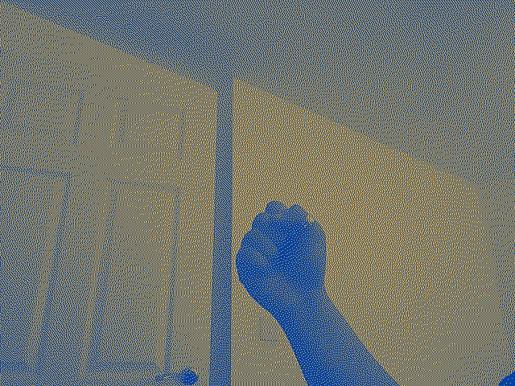
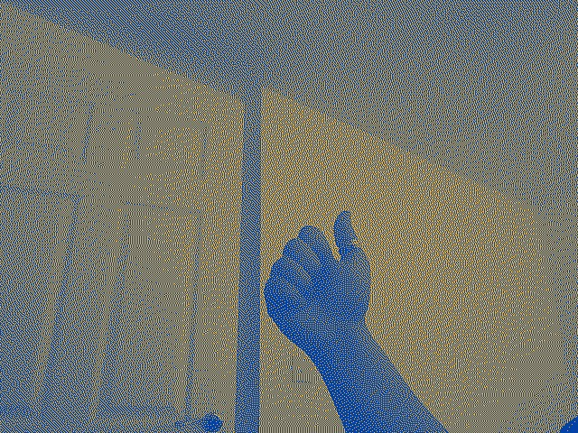
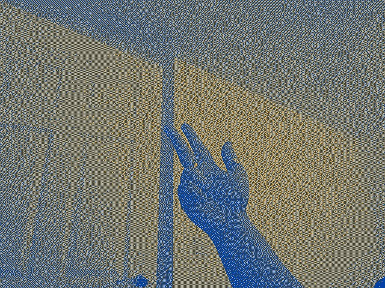
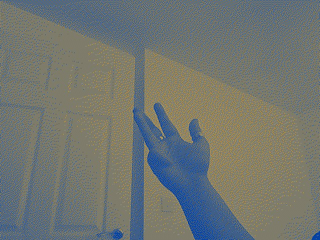
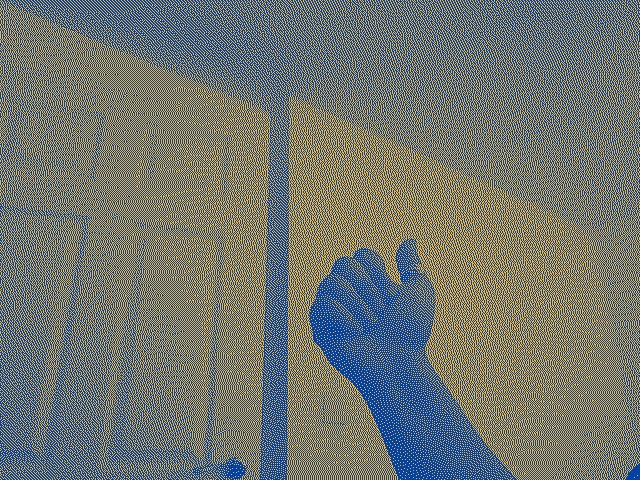

# Week-05 Task

Implement a real-time image processing system 
using your webcam. Combine a dithering algorithm with one of the 
filters we looked at last week. The processed image should update 
continuously as the webcam feed changes, showing both the dithering 
effect and the selected filter. Use the saveFrame function to make a 
story reel of up to 10 pictures like in a comic book

## Requirements

Written in Processing 4.3

No special libraries required. 

## Operation

Run `dither_cam_story_reel.pde` in Processing.

## Screengrab

Video of sketch: https://drive.google.com/file/d/1rZPuuFoo_-g1xeT2XcuyYhhneWVC9qY8/view?usp=sharing

## Design notes

This sketch did not feel too difficult at first, but my main challenge was figuring out when to use dithering. 
My initial problem was that I was using duochrome instead of converting the image to monochrome.
I realised that to use dithering, I needed to convert each image of the webcam recorded into monochrome black and white. I then needed to apply dithering, and once that was done to all pixels, I then needed to apply the duochrome filter each each pixel _after_ the dithering was complete. This all needed to be done for every frame generated by the webcam.